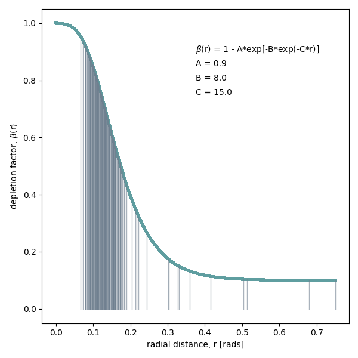

***********************************
Optimizations
***********************************

There two available strategies for optimization:

1. Manual choice of pixel dilution factors on annular rings.
2. Depletion function

.. _optim_manual:

Manual choice of pixel dilution factors on annular rings
========================================================

.. _optim_depletion:

Depletion function
===============================

the depletion function is defined as:

.. math::

   \beta(r) = 1 - A * exp(-B*exp(-C*r))

And in implemented in the function :meth:`cmfg.deplete_profile`. The
default values for the parameters are:

* A = 0.9
* B = 8
* C = 15

This function allows to adapt the dilution in the number of pixels
using several configurations.

.. https://www.geogebra.org/m/ecdptetr
.. raw:: html

   <iframe scrolling="no" title="deplete_profile" src="https://www.geogebra.org/material/iframe/id/ecdptetr/width/1920/height/895/border/888888/sfsb/true/smb/false/stb/false/stbh/false/ai/false/asb/false/sri/false/rc/false/ld/false/sdz/false/ctl/false" width="1920px" height="895px" style="border:0px;"> </iframe>
